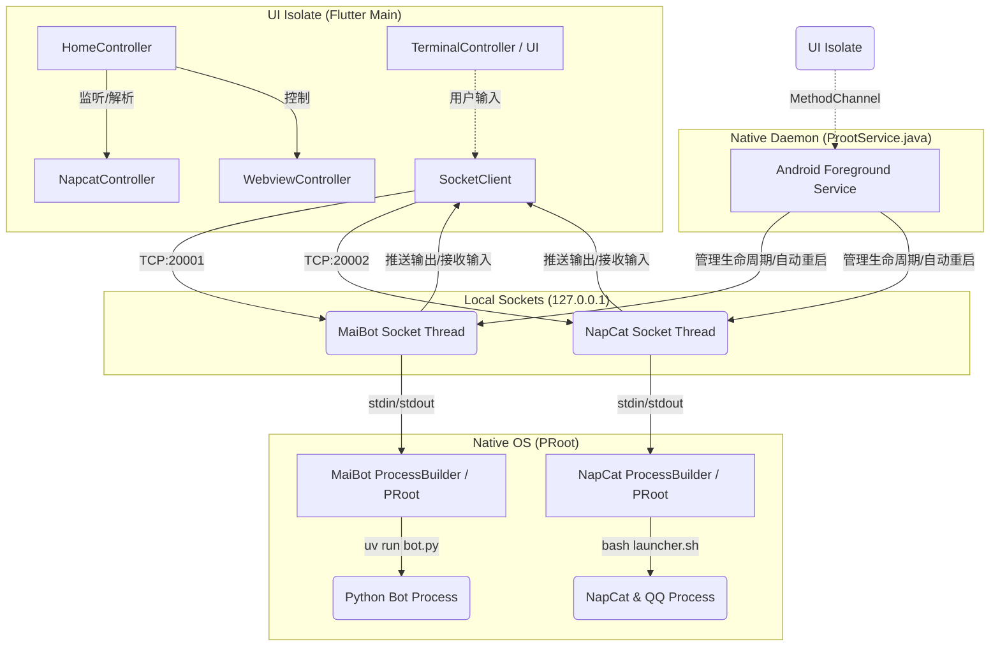
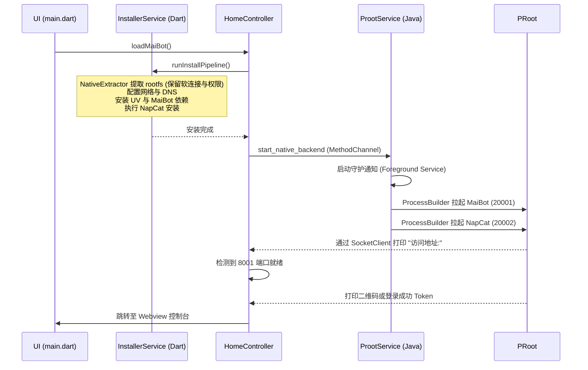

# MaiBot Android App 架构设计与流程文档

MaiBot Android 是一个 Flutter/GetX 应用程序，其核心目标是在 Android 设备上运行基于 Ubuntu PRoot 的 Linux 容器，并在该容器内后台驻留并运行 MaiBot（Python 机器人）和 NapCatQQ（QQ 协议适配器）。

## 1. 核心架构概述

应用整体划分为三个主要执行环境：
1. **UI Isolate (Flutter 引擎主线程)**：负责应用界面、状态管理 (GetX)、Webview 渲染、日志解析以及向后台服务下发控制指令。
2. **Native Background Service (ProotService)**：运行在独立 Android Service 进程 (`:backend`)。完全摒弃了 Dart Isolate，使用纯 Java 维持后台保活，并负责原生拉起、监控、自动重启底层的 PRoot 进程，彻底杜绝了 Flutter 带来的 OOM 系统查杀问题。
3. **原生进程层 (Ubuntu PRoot)**：通过原生 ProcessBuilder 运行的两个独立 Linux 容器进程：
   - **MaiBot 进程**：运行 Python 机器人核心逻辑。
   - **NapCat 进程**：运行 NapCatQQ 适配器及 Linux QQ。

两者之间通过 **Socket (127.0.0.1)** 进行输入输出的数据流转发，实现了 UI 与原生后台进程的完全解耦。
## 2. 关键系统流程图

### 2.1 进程与通信架构 (Process & Communication Flow)



### 2.2 环境初始化与安装流 (Bootstrapping & Installation)



## 3. 核心模块与实现细节

### 3.1 环境引导器 (EnvBootstrapper) 与 W^X 机制绕过
自 Android 10 (API 29) 起，系统强制执行 W^X (Write XOR Execute) 安全策略，禁止应用在数据目录 (`/data/data/...`) 直接执行自行下载或创建的二进制文件。为了绕过这一限制，App 采用了 **SO 文件伪装方案**：
1. 将 `bash`, `proot`, `busybox` 等底层二进制文件以后缀名 `.so` (如 `libbash.so`) 的形式打包在应用的 `jniLibs` 中。
2. 安装应用时，Android 包管理器 (PackageManager) 会将其作为合法的原生库解压到具有可执行权限的路径下。
3. 应用冷启动时，`EnvBootstrapper` 会读取这些库文件的绝对路径，并通过 `Link` (软连接) 的方式，在数据目录下的 `bin` 文件夹中创建去除了 `lib` 和 `.so` 前缀的映射（如 `bin/bash -> libbash.so`）。
4. 接着，它会调用 `busybox` 创建如 `ls`, `cat`, `grep`, `tar` 等一系列常用命令的软连接。

这为后续启动 PRoot 容器奠定了合法的原生执行基础。

### 3.2 原生守护进程服务 (ProotService.java)
彻底重构抛弃了原有的 `flutter_foreground_task`，改为采用纯原生的 `Android Service`。
- **进程托管**：通过 Java 的 `ProcessBuilder` 构造包含 `ubuntuPath`、挂载目录 (`/dev`, `/proc`, `/sys`, `/tmp`) 以及 `LD_LIBRARY_PATH` 等环境变量的容器启动参数，拉起 MaiBot 和 NapCat 进程。
- **双向数据流桥接**：启动 TCP ServerSocket（端口 20001 和 20002）。客户端连接后，Service 会开辟独立线程用于将 Socket 的输入流写入 `proot` 进程的 `stdin`，同时将进程的 `stdout/stderr` 加入长度达 70000 字节的环形历史缓冲区中，并广播给所有已连接的 Flutter UI 客户端。
- **自动重启与防杀**：当子进程退出时，Java 定时器会触发指数退避延迟（最高 60 秒）来拉起进程。配置 `START_REDELIVER_INTENT`，当系统因极低内存（OOM）清理 Service 后，Android 会带上原有的路径参数自动恢复进程，极大增强了后台保活能力。
- **防僵尸泄漏**：在退出或重启阶段，调用 `busybox killall -9 proot` 严格清理底层容器的游离进程，防止资源泄漏。
### 3.4 Dart 驱动的安装流 (InstallerService)
MaiBot 核心依赖复杂的 Linux 依赖栈，原来依靠冗长的 Shell 脚本执行。现在的版本改由 Dart 的 `InstallerService` 提供结构化和可视化的安装：
- **环境提取 (NativeExtractor)**：使用 `archive` 库配合 FFI (底层 `chmod` 调用)在独立 Isolate 中完成 `tar.xz` 容器环境的高性能解压，并且精准恢复 POSIX 软连接和执行权限。
- **自动化部署流水线**：
  1. **挂载与配置**：注入强力 DNS 配置对抗安卓局域网限制，关闭 APT Pipeline 防止下载卡死。
  2. **包管理与安装**：下载安装极速 Python 依赖管理器 `uv`。
  3. **仓库拉取 (Git)**：直接驱动 `proot` 在容器内完成 MaiBot 源码克隆和 `uv sync` 的依赖同步。
  4. **配置穿透机制 (`config_service.dart`)**：通过读取并解析 NapCat 的 `onebot11.json` 及 MaiBot 的 TOML，进行双向验证及智能填补，实现 WebSocket 端口和 Token 的完美无缝同步。
### 3.5 智能日志分析 (NapcatLogParser)
UI 层的 `NapcatController` 和 `HomeController` 通过 Socket 不断消费后台 PTY 吐出的日志（剥离 ANSI 控制符后进行正则匹配）：
- **登录状态与 WebUI 发现**：捕获类似 `[NapCat] 登录成功` 或 `🔑 WebUI 登录 Token` 的字样，提取 Token 放入全局状态，并在探测到本地 8001/6185 端口就绪后自动拉起内置 Webview。
- **二维码拦截与渲染**：当后台生成 QQ 登录二维码图片 (`qrcode.png`) 时，触发 UI 层的 GetX Dialog 向用户展示，省去了用户去寻找二维码文件的步骤，提供沉浸式体验。
- **免扫码探测**：读取本地 `webui.json` 或 `onebot11_XXX.json` 检测是否已经存在已缓存登录的 QQ 账号。

### 3.6 数据备份与恢复 (BackupService)
备份机制通过原生 `busybox tar` 在后台完成，流程如下：
1. **一致性保护**：执行前通过 `ForegroundServiceManager.stopService()` 发出 MethodChannel 指令彻底暂停 Java 服务，Java 层通过 `killall -9` 终止残留的 `node`、`python` 进程，确保打包时文件处于静止状态。
2. **按需打包**：执行 `tar -czf` 将 `/root/MaiBot/data`, `config`, `plugins` 以及 `/root/napcat/config` 打包到宿主机的 `/sdcard/Download/MaiBot` 目录。
3. **自动恢复**：备份完成后（或抛出异常时），再调用 `ForegroundServiceManager.restartContainer()` 重新拉起原生前台守护服务与容器。

### 3.7 UI 状态与安装进度协同 (ProgressTracker & Controllers)
- **ProgressTracker**：在 `InstallerService` 中将进度字符串注入 UI，再由轮询结合 `Timer` 更新界面。不再依赖老旧的文件系统 `inotify` 强耦合。
- **WebviewController**：借助 `settings` 库 (`box?.put`) 实现简单的键值对持久化，保存用户自定义的 WebUI 列表。
## 4. 目录结构说明

```text
lib/
├── main.dart                       # 应用程序入口
├── core/
│   ├── config/app_config.dart      # 端口定义、包名、控制消息常量
│   ├── constants/scripts.dart      # 原生 Linux 伪系统信息挂载脚本与常量
│   ├── services/
│   │   ├── backup_service.dart     # 配置备份与恢复
│   │   ├── env_bootstrapper.dart   # SO库软连接引导
│   │   ├── foreground_service.dart # 与原生 Java ProotService 通信
│   │   ├── installer_service.dart  # Dart驱动的自动化容器安装与部署流
│   │   ├── native_extractor.dart   # 高性能纯原生 Isolate 解压与权限恢复
│   │   ├── config_service.dart     # JSON/TOML 配置双向穿透与填补
│   │   ├── progress_tracker.dart   # 安装与运行状态指示器
│   │   └── socket_stream_client.dart # UI 层连接 Java 原生端口的数据流客户端
│   └── utils/
├── ui/
│   ├── controllers/                # GetX 控制器
│   │   ├── terminal_controller.dart # 包含 HomeController，编排服务与UI逻辑
│   │   ├── napcat_controller.dart  # 专管 QQ 扫码登录与 Token 获取
│   │   ├── webview_controller.dart # 管理内置浏览器的 URL 计算
│   │   └── napcat_log_parser.dart  # 正则解析终端日志流
│   ├── navbar/                     # 底部导航栏
│   ├── pages/                      # 页面 UI (Terminal, Webview, Settings)
│   └── routes/app_routes.dart      # 路由表
assets/
├── config.toml                     # MaiBot 默认配置
└── ubuntu-noble-aarch64-pd-v4.18.0.tar.xz # PRoot 基础环境压缩包
android/app/src/main/java/.../
├── ProotService.java               # 核心后台保活、Socket桥接、Process守护进程
├── MainActivity.java               # 承接 MethodChannel 控制信号

## 5. 设计亮点总结
1. **完全无服务器 (Serverless on Android)**：依靠 PRoot 与原生的系统调用拦截，在非 Root 的普通 Android 机上跑起完整的 NodeJS + Python 生态。
2. **纯原生守护进程与强容错**：由纯 Java 构建的 Service 脱离了 Flutter 的内存管制，配合 `START_REDELIVER_INTENT` 实现指数级容灾重启；并且严格使用 `killall` 控制僵尸进程泄漏。
3. **安装执行双分离**：在 Dart Isolate (`InstallerService`) 中执行高度可视化的部署流水线，与后端无关；UI 生命周期与底层进程被 `Socket` 完美解耦。
